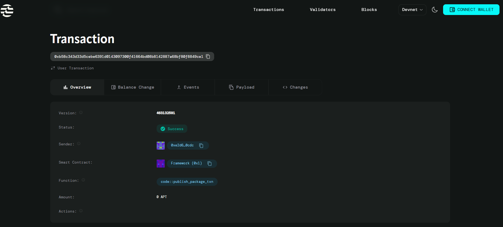

# Aptos Move Smart Contract Project

This repository contains a **Move smart contract project** built using the **Aptos CLI** and developed in **VS Code**.  
The project is configured for **Aptos Devnet** and is intended for learning, development, and experimentation with the Move language.

---

## 🧭 Project Overview

- **Blockchain:** Aptos
- **Smart Contract Language:** Move
- **Network:** Devnet
- **Tooling:** Aptos CLI, PowerShell, VS Code
- **Purpose:** Build, compile, test, fund, and publish Move smart contracts

---

## 📁 Directory Structure

```

aptos/
├── Move.toml        # Move package configuration
├── sources/         # Move smart contract modules
├── tests/           # Move unit tests
├── scripts/         # Optional scripts
├── .aptos/          # Local Aptos metadata (DO NOT COMMIT)
└── README.md

````

---

## ⚙️ Prerequisites

- Windows 10 or Windows 11  
- PowerShell  
- Visual Studio Code (recommended)  
- Aptos CLI installed  

Verify Aptos CLI installation:

```powershell
aptos --version
````

---

## 🛠️ Installing Aptos CLI (Windows)

If not installed yet:

```powershell
Set-ExecutionPolicy RemoteSigned -Scope CurrentUser
iwr https://aptos.dev/scripts/install_cli.ps1 | iex
```

Restart your terminal after installation.

---

## 🚀 Getting Started

### 1️⃣ Initialize Aptos Configuration

Run once:

```powershell
aptos init
```

**Recommended input:**

* Network: `devnet`
* Private key: **Press Enter** (auto-generate)

This creates configuration files at:

```
C:\Users\<your-username>\.aptos\
```

---

### 2️⃣ Verify Account Setup

```powershell
aptos account list
```

You should see a default profile with an account address.

---

## 🧱 Build & Compile

Compile the Move package from the project root:

```powershell
aptos move compile
```

This command:

* Downloads dependencies
* Checks Move syntax
* Ensures the package builds successfully

---

## 💰 Fund Your Devnet Account

Before publishing contracts, fund your account:

```powershell
aptos account fund-with-faucet
```

This adds free test APT (Octas) on devnet.

---

## 🚀 Publish Smart Contracts

Deploy your Move module to Aptos devnet:

```powershell
aptos move publish
```

Confirm when prompted.
On success, your contract is live on devnet.

---

## 🧪 Run Tests

Execute unit tests written in the `tests/` directory:

```powershell
aptos move test
```

---

## ✍️ Writing Move Code

* Add new `.move` files inside the `sources/` directory
* Update code
* Recompile:

  ```powershell
  aptos move compile
  ```
* Republish changes:

  ```powershell
  aptos move publish
  ```

---

## 🧠 Common Aptos CLI Commands

```powershell
aptos help
aptos account list
aptos config show-profiles
aptos move compile
aptos move test
aptos move publish
```

---

## 🛠️ VS Code Recommendations

* Use **PowerShell** as the integrated terminal
* Install a **Move language extension** for syntax highlighting
* Keep one Move project per repository
* Avoid committing secrets

---

## 🔐 Security & Key Management (IMPORTANT)

* ❌ **DO NOT commit**:

  * `.aptos/`
  * `private_key.json`
* Your private key is stored locally at:

  ```
  C:\Users\<your-username>\.aptos\private_key.json
  ```
* Back up this file securely (password manager or encrypted storage)
* Anyone with this key controls your account

---

## 🌐 Networks

This project uses:

* **Devnet** (default, free faucet)

Other supported networks:

* `testnet`
* `mainnet` (requires real APT — use with caution)

---

## 🧩 Troubleshooting

**`aptos` command not found**

* Restart your terminal
* Ensure Aptos CLI is installed
* Run: `where aptos`

**`aptos move init` unexpected argument**

* Use:

  ```powershell
  aptos move init --name <project_name>
  ```

**Empty account list**

* Run `aptos init` successfully
* Press Enter when asked for private key

---

## 📚 Learning Resources

* Aptos Docs: [https://aptos.dev](https://aptos.dev)
* Move Book: [https://move-book.com](https://move-book.com)
* Aptos Framework: [https://github.com/aptos-labs/aptos-framework](https://github.com/aptos-labs/aptos-framework)

---

## 📝 License

This project is provided for **educational and development purposes** only.
Use caution when deploying to production or mainnet.

---

## ✅ Project Status

* Aptos CLI installed ✔️
* Account initialized ✔️
* Move project created ✔️
* Compilation successful ✔️
* Devnet account funded ✔️
* Ready for development and publishing ✔️





